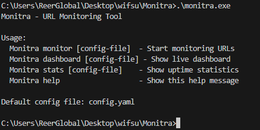
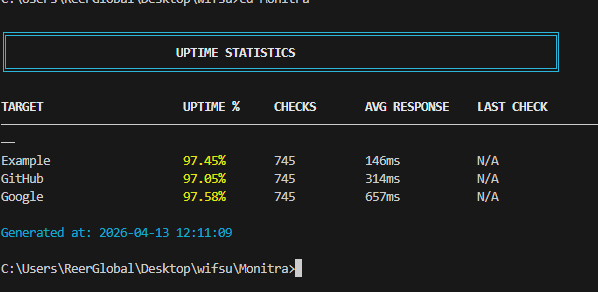
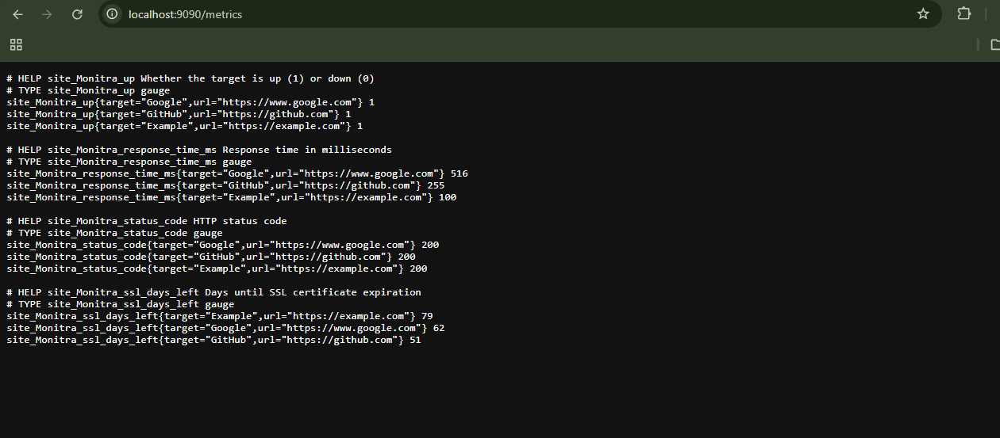
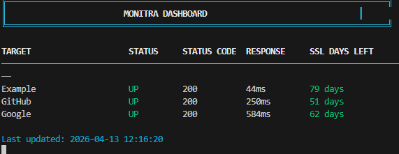
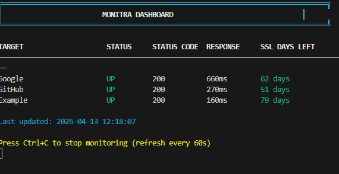

#  Monitra

A production-style lightweight **URL monitoring and observability tool** built in Go.
Tracks uptime, response time, SSL expiration, and status codes with persistent storage and real-time terminal dashboards.

---

# 🚀 Key Features

* ⚡ Concurrent URL monitoring (goroutines)
* 📊 Real-time terminal dashboard (live refresh)
* 💾 SQLite persistence (historical tracking)
* 🔐 SSL certificate expiry monitoring
* 📈 Uptime statistics per target
* 📡 Prometheus metrics endpoint (optional)
* 🔔 Webhook + email notification support
* ⚙️ YAML-based configuration

---

# 🧱 System Architecture

```
                +----------------------+
                |   CLI (main.go)     |
                +----------+-----------+
                           |
        +------------------+------------------+
        |                  |                  |
   monitor            dashboard            stats
        |                  |                  |
        v                  v                  v
+----------------+  +----------------+  +----------------+
| HTTP Checks    |  | DB Reader      |  | DB Aggregation |
| (goroutines)   |  | (SQLite)       |  | (uptime calc)  |
+--------+-------+  +--------+-------+  +--------+-------+
         |                   |                    |
         +---------+---------+--------------------+
                   |
           +------------------+
           | SQLite Database  |
           | check_results    |
           +------------------+
```

---

# ⚙️ Installation

```bash
git clone <repo-url>
cd Monitra
go build -o Monitra ./cmd/sentinel
```

---

# 📄 Configuration

Create `config.yaml`:

```yaml
check_interval: 60

database:
  path: sentinel.db

targets:
  - name: Google
    url: https://www.google.com
    check_ssl: true

  - name: GitHub
    url: https://github.com
    check_ssl: true

metrics:
  enabled: true
  port: 9090
  path: /metrics
```

---

# ▶️ Usage

---

## 🔍 Start Monitoring (Core Engine)

```bash
./monitra monitor config.yaml
```

### What it does:

* Runs concurrent health checks
* Stores results in SQLite
* Displays live terminal dashboard
* Sends notifications (if enabled)
* Updates Prometheus metrics

---

## 📊 View Dashboard (Read-only UI)

```bash
./monitra dashboard config.yaml
```

### Shows:

* Latest stored results
* No active monitoring
* Clean table view

---

## 📈 View Statistics

```bash
./monitra stats config.yaml
```

### Shows:

* Uptime %
* Total checks
* Average response time
* Last check time

---

# 📸 Screenshots 







#  Architecture Explanation 

## Design Philosophy

This system follows a **clean separation of concerns**:

* `monitor` → data collection layer
* `db` → persistence layer
* `dashboard` → presentation layer
* `metrics` → observability layer
* `main` → orchestration layer

---

# 🔥 Engineering Highlights

### ✔ Concurrency Model

Uses goroutines to execute HTTP checks in parallel for performance.

### ✔ Persistence

SQLite ensures historical tracking without external dependencies.

### ✔ Observability

Supports:

* terminal UI
* Prometheus metrics
* uptime analytics

---

Built by 💖Ruth Naomi